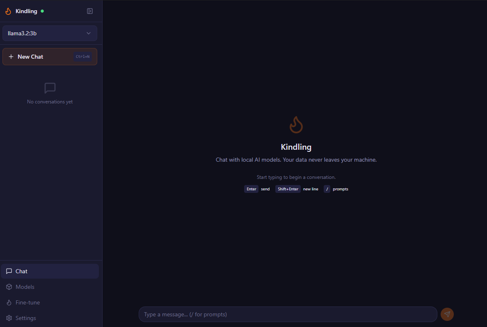

# Kindling

A desktop app for chatting with local LLMs. Built with Tauri and React, it talks to [Ollama](https://ollama.com/) running on your machine. Nothing leaves your computer — no accounts, no cloud, no API keys.



## What it does

- **Chat** with any Ollama model, streamed in real time
- **Manage models** — pull, delete, and switch between them from inside the app
- **Conversation history** saved locally in SQLite
- **System prompts** — save and reuse custom personas
- **Fine-tuning** — train LoRA adapters on your own documents (experimental, requires Python sidecar)
- **Keyboard-driven** — shortcuts for everything (`Ctrl+/` to see them all)
- **Dark and light themes** with system preference detection

## Stack

| Layer | Tech |
|---|---|
| Desktop shell | [Tauri v2](https://v2.tauri.app/) (Rust) |
| Frontend | React 19, TypeScript, Tailwind CSS, Vite |
| Inference | [Ollama](https://ollama.com/) |
| Storage | SQLite via rusqlite (bundled, zero config) |
| Fine-tuning | Python sidecar (HuggingFace Transformers + PEFT) |

## Getting started

You'll need:

- [Node.js](https://nodejs.org/) v18+
- [Rust](https://rustup.rs/) (latest stable)
- [Ollama](https://ollama.com/download) installed and running
- On Windows: Visual Studio 2022 with the C++ desktop workload

```bash
# install JS dependencies
npm install

# run in dev mode (hot-reload frontend + native backend)
npm run tauri dev

# build a production binary
npm run tauri build
```

First build compiles all Rust dependencies, so it takes a few minutes. After that it's fast.

If Ollama is running and has at least one model pulled, the app connects automatically. If not, the onboarding screen walks you through it.

## Fine-tuning setup

The LoRA fine-tuning wizard needs Python 3.10+ with ML dependencies:

```bash
cd sidecar
pip install -r requirements.txt
```

GPU-accelerated training requires CUDA-compatible PyTorch. The wizard detects your hardware and recommends settings.

## Keyboard shortcuts

| Shortcut | Action |
|---|---|
| `Ctrl+N` | New conversation |
| `Ctrl+B` | Toggle sidebar |
| `Ctrl+F` | Search conversations |
| `Ctrl+,` | Settings |
| `/` | Open prompt picker (empty input) |
| `F2` | Rename conversation |
| `Ctrl+/` | Show all shortcuts |

On macOS, use `Cmd` instead of `Ctrl`.

## Project structure

```
src/                    # React frontend
  components/
    chat/               # ChatView, MessageBubble, InputBar
    sidebar/            # Sidebar, ConversationList, ModelSelector
    models/             # ModelBrowser (pull/delete/filter)
    settings/           # SettingsPanel, SystemPrompts, HardwareInfo
    training/           # TrainingWizard, TrainingProgress
  lib/
    api.ts              # Tauri invoke wrappers
    types.ts            # Shared TypeScript types
src-tauri/              # Rust backend
  src/
    main.rs             # App state, plugin init
    db.rs               # SQLite schema, queries, migrations
    ollama.rs           # Ollama HTTP client (streaming)
    commands/            # Tauri command handlers
```

## License

MIT
